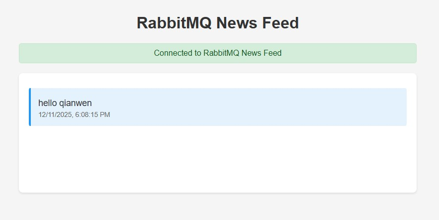

# RabbitMQ News Feed Site 

1. start rabitmq
```
docker run -d --name rabbitmq -p 5672:5672 -p 15672:15672 rabbitmq:3-management
```

2. start web site service
```
cd service
mvn clean jetty:run
```
Open portal: http://localhost:8080/demo/

3. start client
```
cd client
mvn clean package
mvn exec:java "-Dexec.mainClass=com.example.App"
```
Enter message: hello

Portal shows the received message:


